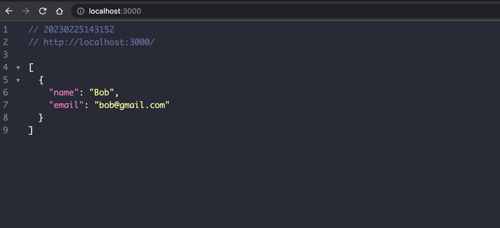

# Dockerfile Practice
- This project is aimed at practicing writing a Dockerfile and containerizing a Node.js web application. 
- The website is designed to respond an user information in JSON format.
- Framework: Express.js
- Images:
	

## Setup
- `docker build -t user-sercice:latest .`
- `docker run --name user-service -d -p 3000:3000 user-service:latest`
- Visit [http://localhost:3000](http://localhost:3000)
